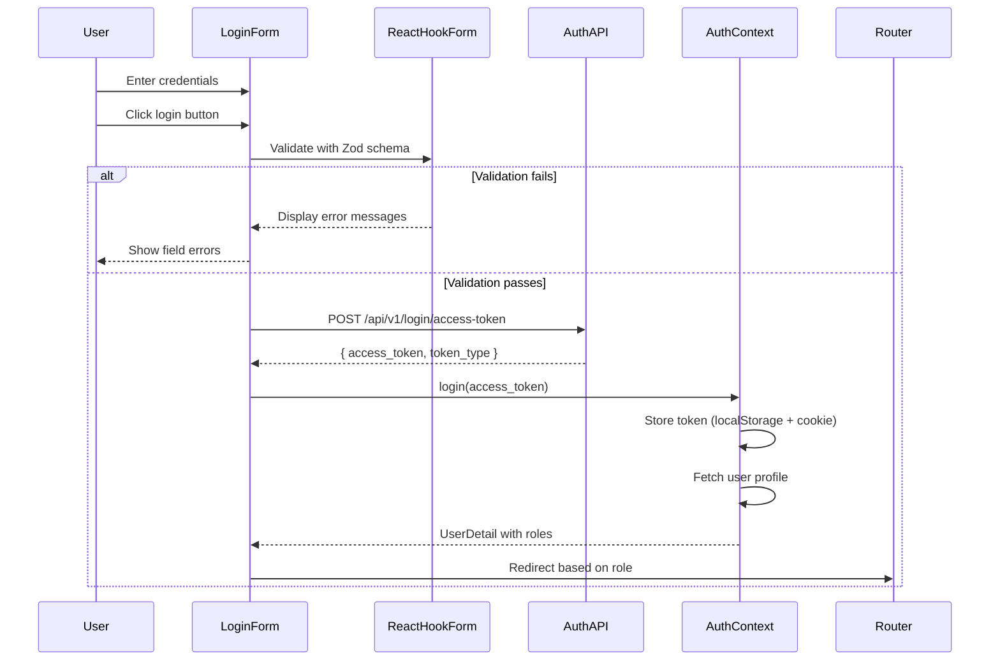

# Design Document: Login Page Refactor

## Overview

This document describes the technical design for refactoring the login page to use React Hook Form + Zod for validation and Shadcn/ui components for UI. The design addresses the critical issue of native form submission in Next.js 16 + React 19 and implements role-based redirection.

### Key Design Decisions

1. **Form Management**: Use `react-hook-form` with `@hookform/resolvers/zod` for type-safe, declarative validation
2. **UI Components**: Use Shadcn/ui components (`Card`, `Input`, `Label`, `Button`) for consistent styling
3. **Form Submission Prevention**: Use `type="button"` with `onClick` handler instead of native form submission to avoid Next.js 16 + React 19 issues
4. **Component Separation**: Extract `LoginForm` into a separate component to handle `useSearchParams()` with Suspense boundary

---

## Architecture

### Component Structure

```
app/(auth)/login/
├── page.tsx              # Page wrapper with Suspense
└── login-form.tsx        # Form component (uses useSearchParams)
```

### Data Flow



### State Management

| State | Location | Type | Purpose |
|-------|----------|------|---------|
| Form values | React Hook Form | `UseFormReturn<LoginFormValues>` | Email, password inputs |
| Validation errors | React Hook Form | `FieldErrors<LoginFormValues>` | Field-level error messages |
| Submission state | React Hook Form | `formState.isSubmitting` | Loading indicator |
| Auth state | AuthContext | `AuthContextType` | User, token, roles |
| Redirect URL | URLSearchParams | `callbackUrl` | Post-login redirect target |

---

## Components and Interfaces

### LoginFormValues (Zod Schema)

```typescript
// lib/schemas/login.ts
import { z } from 'zod';

export const loginFormSchema = z.object({
  email: z
    .string()
    .min(1, { message: '请输入邮箱' })
    .email({ message: '请输入有效的邮箱地址' }),
  password: z
    .string()
    .min(1, { message: '请输入密码' })
    .min(6, { message: '密码至少为 6 位' }),
});

export type LoginFormValues = z.infer<typeof loginFormSchema>;
```

### LoginForm Component

```typescript
// app/(auth)/login/login-form.tsx
'use client';

import { useForm } from 'react-hook-form';
import { zodResolver } from '@hookform/resolvers/zod';
import { useRouter, useSearchParams } from 'next/navigation';
import { toast } from 'sonner';
import { useAuth } from '@/lib/auth/context';
import { login as loginApi } from '@/lib/api/auth';
import { loginFormSchema, LoginFormValues } from '@/lib/schemas/login';

import { Card, CardHeader, CardTitle, CardDescription, CardContent, CardFooter } from '@/components/ui/card';
import { Input } from '@/components/ui/input';
import { Label } from '@/components/ui/label';
import { Button } from '@/components/ui/button';

export function LoginForm() {
  const searchParams = useSearchParams();
  const callbackUrl = searchParams.get('callbackUrl');
  
  const { login } = useAuth();
  const router = useRouter();

  const form = useForm<LoginFormValues>({
    resolver: zodResolver(loginFormSchema),
    defaultValues: {
      email: '',
      password: '',
    },
    mode: 'onChange', // Clear errors as user types
  });

  const { register, handleSubmit, formState, setError } = form;
  const { errors, isSubmitting } = formState;

  async function onSubmit(data: LoginFormValues) {
    try {
      const response = await loginApi(data.email, data.password);
      const user = await login(response.access_token);
      toast.success('登录成功');
      
      // Priority: callbackUrl > role-based redirect
      if (callbackUrl) {
        router.push(callbackUrl);
      } else if (user?.roles.includes('superuser') || user?.roles.includes('teacher')) {
        router.push('/admin');
      } else {
        router.push('/');
      }
    } catch (err: unknown) {
      const message = err instanceof Error ? err.message : '登录失败，请检查账号密码';
      toast.error(message);
    }
  }

  return (
    <div className="flex min-h-screen items-center justify-center bg-muted/50 px-4">
      <Card className="w-full max-w-md">
        <CardHeader>
          <CardTitle className="text-center text-2xl">欢迎回来</CardTitle>
          <CardDescription className="text-center">
            请输入您的账号和密码进行登录
          </CardDescription>
        </CardHeader>
        
        <CardContent className="space-y-4">
          <div className="space-y-2">
            <Label htmlFor="email">邮箱</Label>
            <Input
              id="email"
              type="email"
              placeholder="name@example.com"
              disabled={isSubmitting}
              aria-invalid={!!errors.email}
              aria-describedby={errors.email ? 'email-error' : undefined}
              {...register('email')}
            />
            {errors.email && (
              <p id="email-error" className="text-xs text-destructive">
                {errors.email.message}
              </p>
            )}
          </div>

          <div className="space-y-2">
            <Label htmlFor="password">密码</Label>
            <Input
              id="password"
              type="password"
              disabled={isSubmitting}
              aria-invalid={!!errors.password}
              aria-describedby={errors.password ? 'password-error' : undefined}
              {...register('password')}
            />
            {errors.password && (
              <p id="password-error" className="text-xs text-destructive">
                {errors.password.message}
              </p>
            )}
          </div>
        </CardContent>

        <CardFooter>
          <Button
            type="button"
            className="w-full"
            disabled={isSubmitting}
            onClick={handleSubmit(onSubmit)}
          >
            {isSubmitting ? '登录中...' : '登录'}
          </Button>
        </CardFooter>
      </Card>
    </div>
  );
}
```

### LoginPage Component (Page Wrapper)

```typescript
// app/(auth)/login/page.tsx
import { Suspense } from 'react';
import { LoginForm } from './login-form';

export default function LoginPage() {
  return (
    <Suspense fallback={
      <div className="flex min-h-screen items-center justify-center bg-muted/50">
        <div className="h-8 w-8 animate-spin rounded-full border-4 border-primary border-t-transparent"></div>
      </div>
    }>
      <LoginForm />
    </Suspense>
  );
}
```

---

## Data Models

### Input Types

| Field | Type | Validation | Error Messages |
|-------|------|------------|----------------|
| email | string | Required, valid email format | "请输入邮箱", "请输入有效的邮箱地址" |
| password | string | Required, min 6 characters | "请输入密码", "密码至少为 6 位" |

### API Types (Existing)

```typescript
// Already defined in lib/types/user.ts
interface LoginResponse {
  access_token: string;
  token_type: string;
}

interface UserDetail {
  id: string;
  email: string;
  full_name: string | null;
  is_active: boolean;
  created_at: string;
  roles: string[];
  class_memberships: ClassMembership[];
}
```

---

## Correctness Properties

*A property is a characteristic or behavior that should hold true across all valid executions of a system—essentially, a formal statement about what the system should do. Properties serve as the bridge between human-readable specifications and machine-verifiable correctness guarantees.*

### Property 1: Email Validation

*For any* email input value, the validation SHALL accept only non-empty strings that match the email format pattern `^[^\s@]+@[^\s@]+\.[^\s@]+$`.

**Validates: Requirements 1.2, 1.3**

### Property 2: Password Validation

*For any* password input value, the validation SHALL accept only non-empty strings with at least 6 characters.

**Validates: Requirements 1.4, 1.5**

### Property 3: Form Submission Prevention

*For any* click on the login button, the system SHALL execute the React submit handler and SHALL NOT trigger a native form submission or modify the URL query parameters.

**Validates: Requirements 4.1, 4.2, 4.4**

### Property 4: Callback URL Redirect Priority

*For any* successful login with a `callbackUrl` query parameter present, the system SHALL redirect to the callback URL, overriding role-based defaults.

**Validates: Requirements 6.4**

### Property 5: Loading State Consistency

*For any* form submission in progress, the button SHALL display "登录中..." text and all input fields SHALL be disabled.

**Validates: Requirements 7.1, 7.2**

### Property 6: Error Message Accessibility

*For any* validation error on an input field, the error message element SHALL have an `id` matching the input's `aria-describedby` attribute, and the input SHALL have `aria-invalid="true"`.

**Validates: Requirements 8.2, 8.3**

### Property 7: Input-Label Association

*For any* input field in the login form, there SHALL be an associated Label component with an `htmlFor` attribute matching the input's `id`.

**Validates: Requirements 8.1**

### Property 8: Email Preservation on Error

*For any* authentication error, the email input value SHALL be preserved to allow the user to retry without re-entering their email.

**Validates: Requirements 9.5**

### Property 9: Error Clearing on Input

*For any* input field with a validation error, when the user types in that field, the error message SHALL be cleared.

**Validates: Requirements 3.4**

---

## Error Handling

### Validation Errors

| Scenario | Error Message | Display Location |
|----------|---------------|------------------|
| Empty email | "请输入邮箱" | Below email input |
| Invalid email format | "请输入有效的邮箱地址" | Below email input |
| Empty password | "请输入密码" | Below password input |
| Password < 6 chars | "密码至少为 6 位" | Below password input |

### API Errors

| Error Type | User Message | Technical Action |
|------------|--------------|------------------|
| 401 Unauthorized | Backend error message | Display toast, preserve email input |
| Network error | "登录失败，请检查网络连接" | Display toast, log to console |
| Unexpected error | "登录失败，请检查账号密码" | Display toast, log to console |

### Error Handling Implementation

```typescript
async function onSubmit(data: LoginFormValues) {
  try {
    const response = await loginApi(data.email, data.password);
    // ... success handling
  } catch (err: unknown) {
    // Log for debugging
    console.error('Login error:', err);
    
    // Determine user-facing message
    let message: string;
    if (err instanceof TypeError && err.message.includes('fetch')) {
      message = '登录失败，请检查网络连接';
    } else if (err instanceof Error) {
      message = err.message || '登录失败，请检查账号密码';
    } else {
      message = '登录失败，请检查账号密码';
    }
    
    toast.error(message);
    // Email input is preserved via React Hook Form state
  }
}
```

---

## Testing Strategy

### Test Type Summary

Based on the acceptance criteria analysis:

| Test Type | Count | Examples |
|-----------|-------|----------|
| PROPERTY | 9 | Email validation, password validation, form submission prevention |
| EXAMPLE | 15 | Specific error messages, role-based redirects, loading states |
| INTEGRATION | 3 | API calls, token storage, error handling |
| SMOKE | 18 | Component structure, imports, configuration |

### Unit Tests

Unit tests will verify specific examples and edge cases:

1. **Email Validation Messages**
   - Empty email shows "请输入邮箱"
   - Invalid format shows "请输入有效的邮箱地址"
   - Valid email passes validation

2. **Password Validation Messages**
   - Empty password shows "请输入密码"
   - Password < 6 chars shows "密码至少为 6 位"
   - Valid password passes validation

3. **Form State**
   - Button shows "登录中..." when submitting
   - Inputs are disabled when submitting
   - Form re-enabled after error

4. **Role-Based Redirects**
   - Student role redirects to `/`
   - Teacher role redirects to `/admin`
   - Superuser role redirects to `/admin`

5. **Error Handling**
   - Network error shows "登录失败，请检查网络连接"
   - Unexpected error shows "登录失败，请检查账号密码"
   - Console.error is called on errors

### Integration Tests

Integration tests will verify the complete login flow:

1. **Successful Login Flow**
   - Fill valid credentials
   - Click login button
   - Verify API call made with correct data
   - Verify token stored in localStorage
   - Verify redirect to correct page based on role

2. **Failed Login Flow**
   - Fill invalid credentials
   - Click login button
   - Verify error toast displayed
   - Verify form re-enabled for retry

3. **Callback URL Handling**
   - Navigate to `/login?callbackUrl=/profile`
   - Complete login
   - Verify redirect to `/profile`

### Property-Based Tests

Property-based tests will verify universal properties using a library like `fast-check`:

```typescript
// Test configuration: 100 iterations minimum
// Tag format: Feature: login-page-refactor, Property {number}: {property_text}

import * as fc from 'fast-check';

// Property 1: Email validation
fc.assert(
  fc.property(fc.string(), (email) => {
    const result = loginFormSchema.safeParse({ email, password: 'valid123' });
    const isValid = email.length > 0 && /^[^\s@]+@[^\s@]+\.[^\s@]+$/.test(email);
    return result.success === isValid;
  })
);

// Property 2: Password validation
fc.assert(
  fc.property(fc.string(), (password) => {
    const result = loginFormSchema.safeParse({ email: 'test@example.com', password });
    const isValid = password.length >= 6;
    return result.success === isValid;
  })
);

// Property 3: Form submission prevention
fc.assert(
  fc.property(fc.anything(), async () => {
    // Verify no native form submission occurs
    // Verify no credentials in URL
    return true; // Implementation depends on test setup
  })
);
```

### Smoke Tests

Smoke tests verify code structure and configuration:

1. **Component Structure**
   - LoginForm uses Card, CardHeader, CardTitle, CardDescription, CardContent, CardFooter
   - LoginForm uses Input component from @/components/ui/input
   - LoginForm uses Label component from @/components/ui/label
   - LoginForm uses Button component from @/components/ui/button

2. **Library Integration**
   - Zod schema defined with email and password fields
   - React Hook Form configured with zodResolver
   - useForm hook used for form state
   - useAuth hook used for authentication
   - useRouter used for navigation

3. **Button Configuration**
   - Button has type="button"
   - Button has onClick handler

### Test File Locations

```
frontend/
├── __tests__/
│   └── login-form.test.tsx      # Unit tests
└── e2e/
    └── login.spec.ts            # E2E tests
```

---

## Implementation Notes

### Preventing Native Form Submission

The critical issue in Next.js 16 + React 19 is that `<form>` elements can trigger native GET submissions even with `onSubmit` handlers. The solution:

1. **Do NOT use `<form>` element** - Use `<CardContent>` and `<CardFooter>` as containers
2. **Use `type="button"`** - Prevents form association
3. **Use `onClick={handleSubmit(onSubmit)}`** - Explicit handler binding

This approach completely bypasses the form submission mechanism.

### Suspense Boundary Requirement

Next.js 15+ requires `useSearchParams()` to be used within a Suspense boundary. The solution:

1. Extract `LoginForm` into a separate component
2. Wrap `<LoginForm />` with `<Suspense>` in the page component
3. Provide a loading spinner as fallback

### Zod Resolver Configuration

```typescript
const form = useForm<LoginFormValues>({
  resolver: zodResolver(loginFormSchema),
  defaultValues: { email: '', password: '' },
  mode: 'onChange', // Validate on change to clear errors as user types
});
```

The `mode: 'onChange'` ensures errors are cleared immediately when the user corrects their input.

---

## Migration Checklist

- [ ] Create `lib/schemas/login.ts` with Zod schema
- [ ] Create `app/(auth)/login/login-form.tsx` with new form component
- [ ] Update `app/(auth)/login/page.tsx` with Suspense wrapper
- [ ] Remove old manual validation logic
- [ ] Verify all Shadcn/ui components are installed
- [ ] Run unit tests
- [ ] Run E2E tests
- [ ] Manual testing of all acceptance criteria
